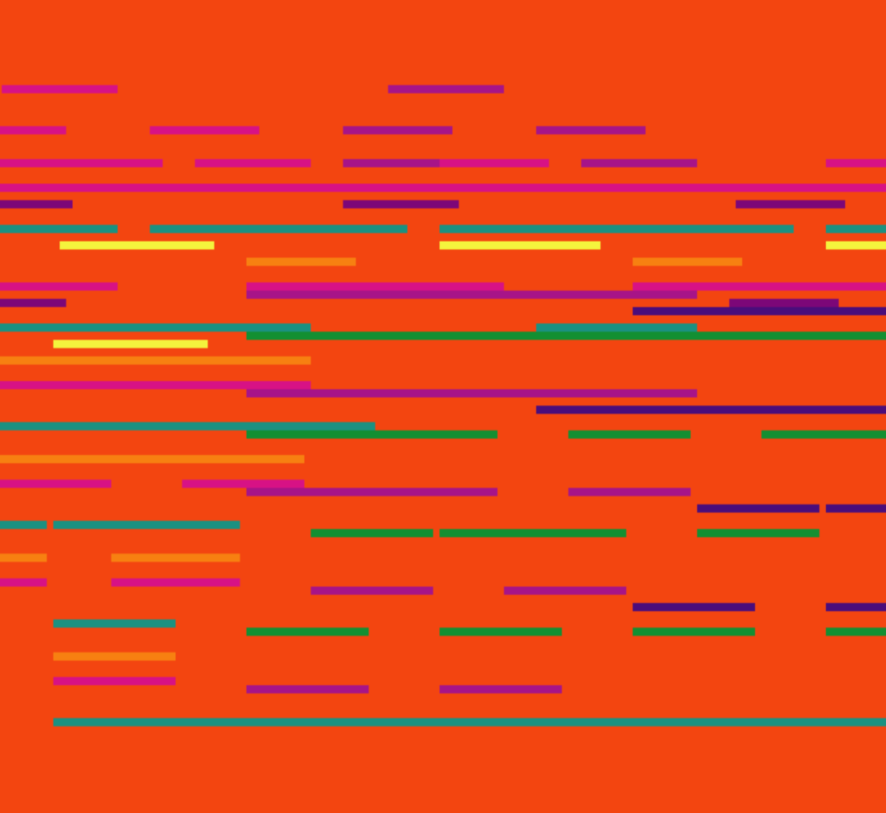
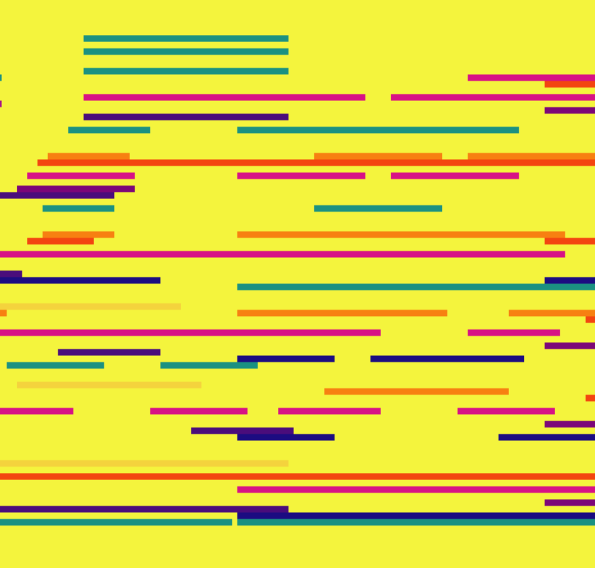
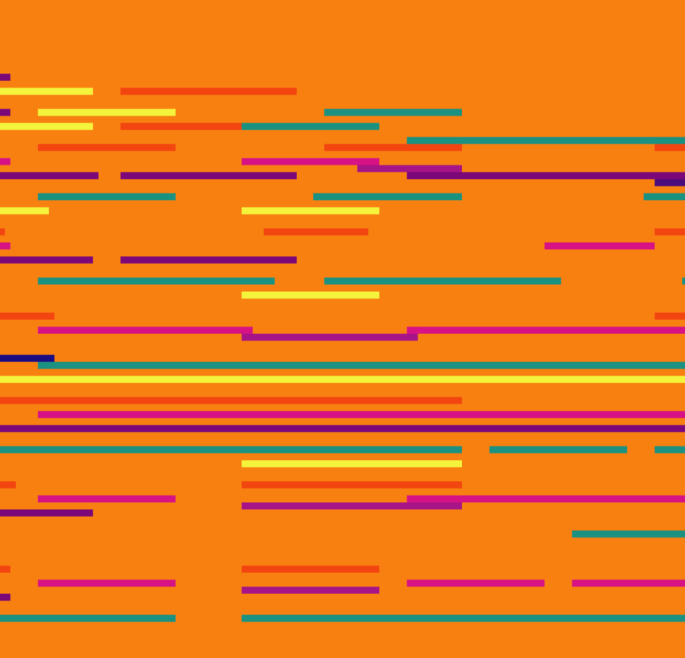
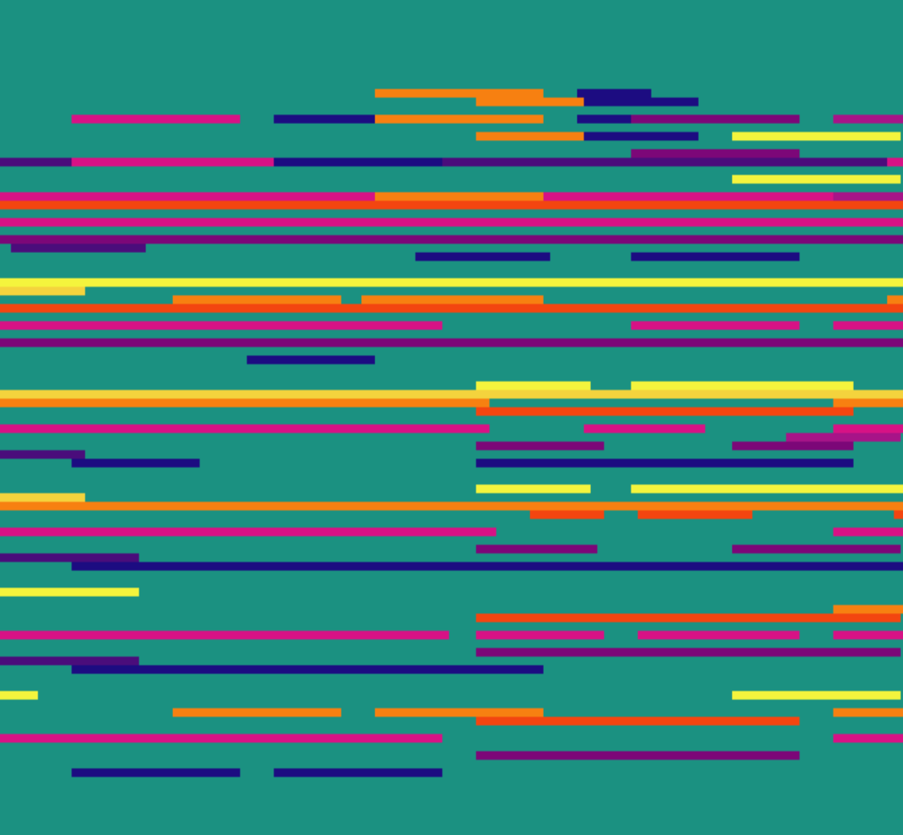

Platmus
=======
Platmus is a psychedelic modernist art experiment. By combining midi files and reactive visualizations, Platmus creates a unique experience that can only be understood by witnessing it.

 
 

Try It
------
**Warning - The visualization contains imagery that could possibly cause photosensitive epileptic seizures. Please exercize caution.**
http://rawgit.com/Magical-Chicken/platmus/master/index.html

Acknowledgements
------
Many thanks to the developers of the libraries used in this project:
https://github.com/mudcube/MIDI.js
